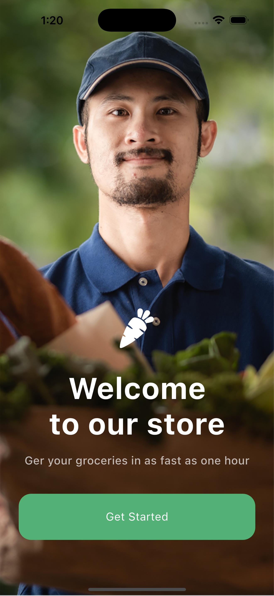
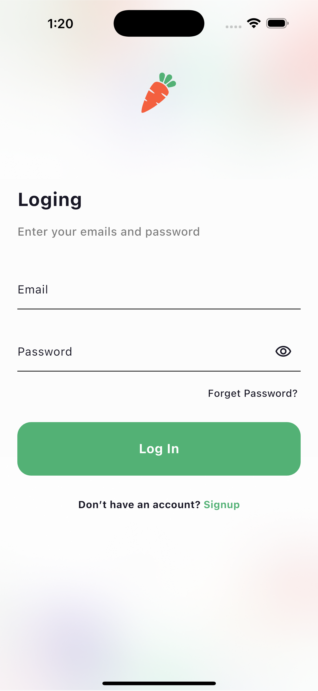
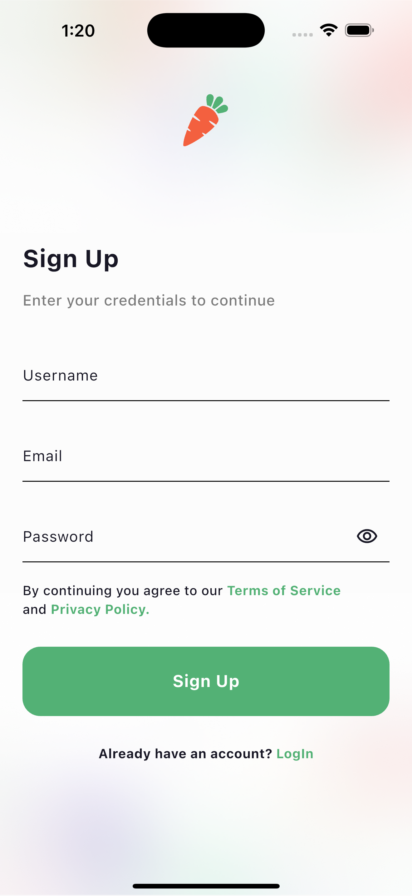
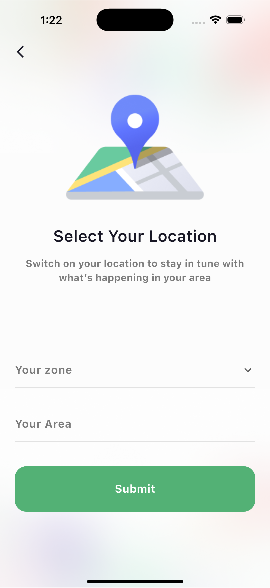
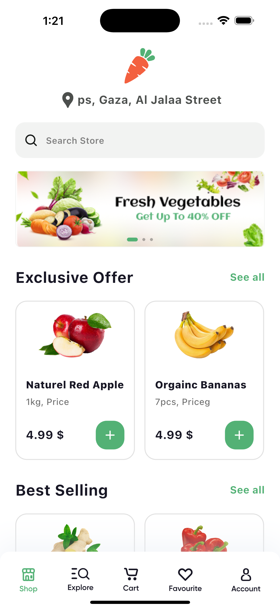
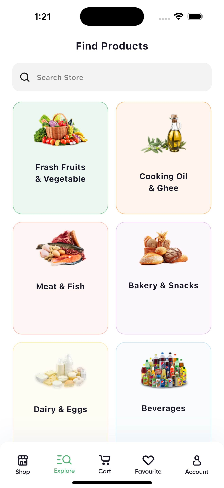
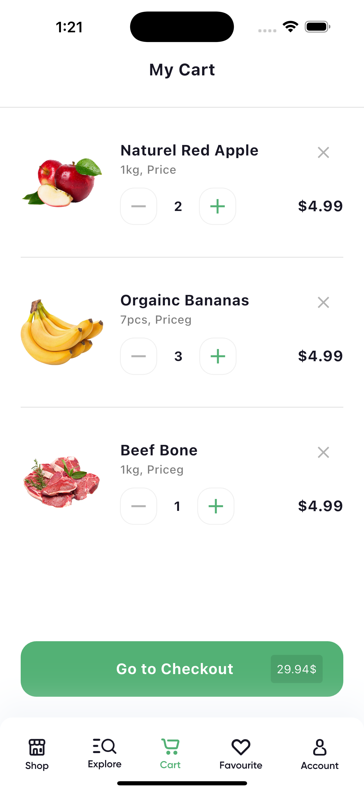
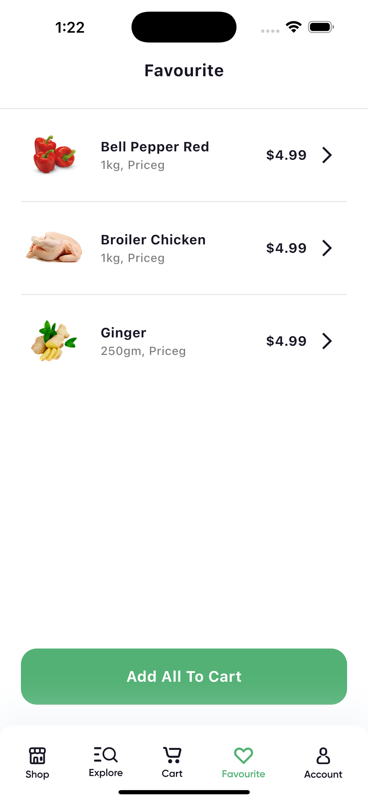
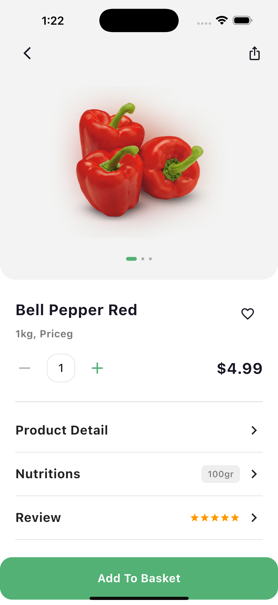
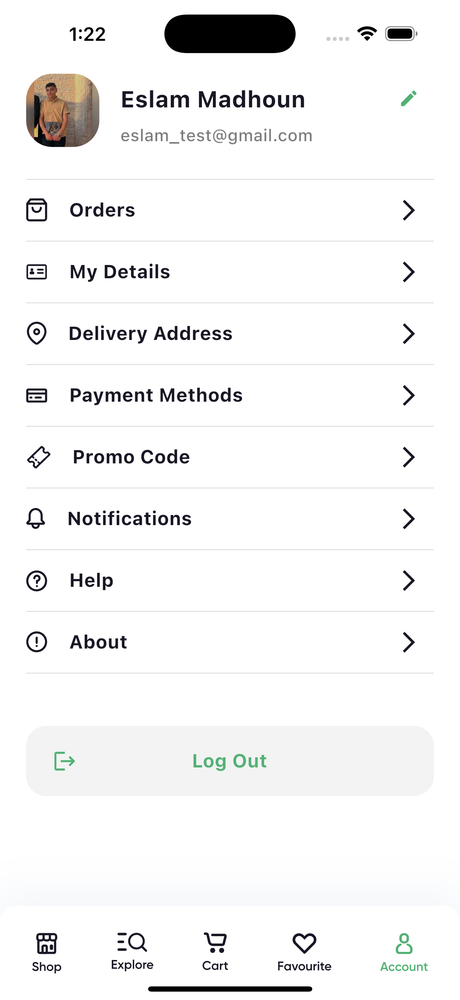

# Nectar - Online Grocery Shopping App

A full-featured grocery shopping mobile application built with **Flutter** and **Firebase**, offering a seamless shopping experience with real-time product browsing, cart management, favorites, and location-based delivery.

## Screenshots

| Splash | Onboarding |
|:---:|:---:|
|  |  |

| Login | Signup | Location |
|:---:|:---:|:---:|
|  |  |  |

| Home | Explore | Cart |
|:---:|:---:|:---:|
|  |  |  |

| Favourite | Product Details | Account |
|:---:|:---:|:---:|
|  |  |  |
## Features

- **Authentication** - Email/password login & registration via Firebase Auth
- **Product Browsing** - Browse products by categories with search functionality
- **Product Details** - Detailed product view with expandable nutrition & description sections
- **Shopping Cart** - Add/remove items, adjust quantities, and checkout
- **Favorites** - Save products to favorites for quick access
- **Location Services** - Auto-detect user location with geocoding for delivery addresses
- **Explore & Search** - Discover products across multiple categories
- **Network Monitoring** - Real-time connectivity status with offline overlay notification
- **Persistent Auth State** - Stay logged in across sessions using SharedPreferences
- **Responsive UI** - Clean, modern design following grocery app UX best practices

## Tech Stack

| Layer | Technology |
|-------|-----------|
| **Framework** | Flutter (Dart) |
| **State Management** | Provider |
| **Backend** | Firebase (Auth + Cloud Firestore) |
| **Location** | Geolocator + Geocoding |
| **Networking** | HTTP package |
| **Local Storage** | SharedPreferences |
| **Connectivity** | connectivity_plus + internet_connection_checker |
| **UI Enhancements** | Flutter SVG, Overlay Support |
| **Environment Config** | flutter_dotenv |

## Architecture

The project follows a **clean architecture** pattern with clear separation of concerns:

```
lib/
 +-- main.dart
 +-- V2/
      +-- Core/
      |    +-- helpers/          # Navigation, routing, providers setup
      |    +-- theme/            # App-wide theming
      |    +-- utils/            # Network connection monitoring
      +-- Data/
      |    +-- models/           # Product & Cart data models
      |    +-- repositories/     # Data access layer (Cart, Favorites, Products)
      |    +-- services/         # API, Auth, and Location services
      +-- features/
           +-- home/             # Home screen with banners & featured products
           +-- shop/             # Main shop browsing
           +-- explore/          # Category exploration
           +-- category/         # Category-specific product listing
           +-- product_details/  # Detailed product view
           +-- cart/             # Shopping cart management
           +-- favourite/        # Saved favorites
           +-- account/          # User profile & settings
           +-- login/            # User login
           +-- signup/           # User registration
           +-- location/         # Delivery location picker
           +-- onbording/        # Onboarding flow
           +-- splash/           # Splash screen
           +-- order_accepted/   # Order confirmation
           +-- widgets/          # Shared/reusable UI components
```

Each feature follows the **MVVM pattern** with dedicated `_page.dart` (View) and `_vm.dart` (ViewModel) files.

## Getting Started

### Prerequisites

- Flutter SDK `^3.7.2`
- Dart SDK `^3.7.2`
- Firebase project configured for Android/iOS
- A `.env` file with required API keys

### Installation

1. **Clone the repository**
   ```bash
   git clone https://github.com/eslammadhoun/nectar.git
   cd nectar
   ```

2. **Install dependencies**
   ```bash
   flutter pub get
   ```

3. **Configure Firebase**
   - Create a Firebase project at [Firebase Console](https://console.firebase.google.com)
   - Add your Android/iOS apps and download the config files
   - Place `google-services.json` in `android/app/`
   - Place `GoogleService-Info.plist` in `ios/Runner/`

4. **Set up environment variables**
   ```bash
   cp .env.example .env
   # Add your API keys to the .env file
   ```

5. **Run the app**
   ```bash
   flutter run
   ```

## Contributing

Contributions are welcome! Feel free to submit a Pull Request.

## License

This project is open source.

## Contact

**Eslam Madhoun** - [eslammadhoun3@gmail.com](mailto:eslammadhoun3@gmail.com)

Project Link: [https://github.com/eslammadhoun/nectar](https://github.com/eslammadhoun/nectar)
